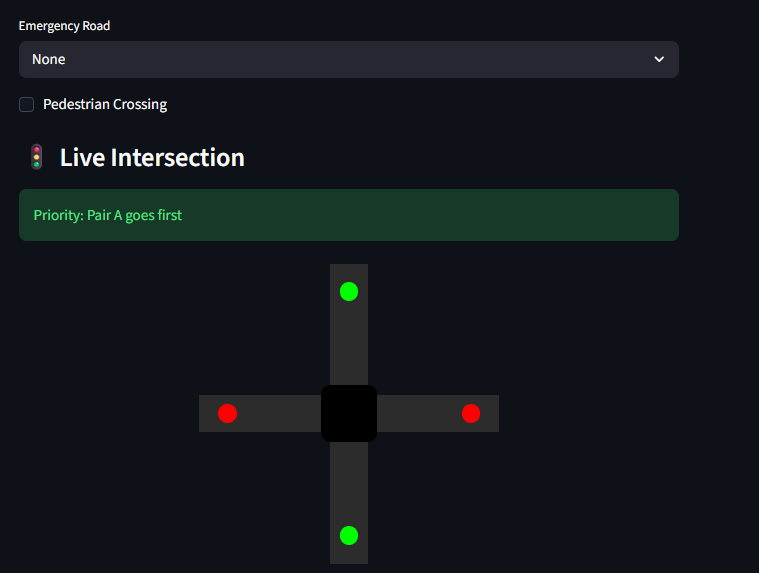
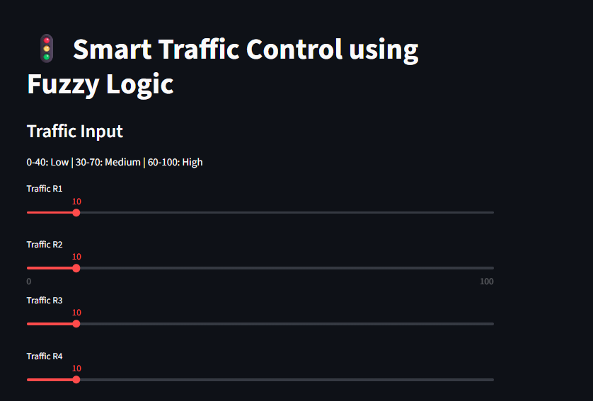
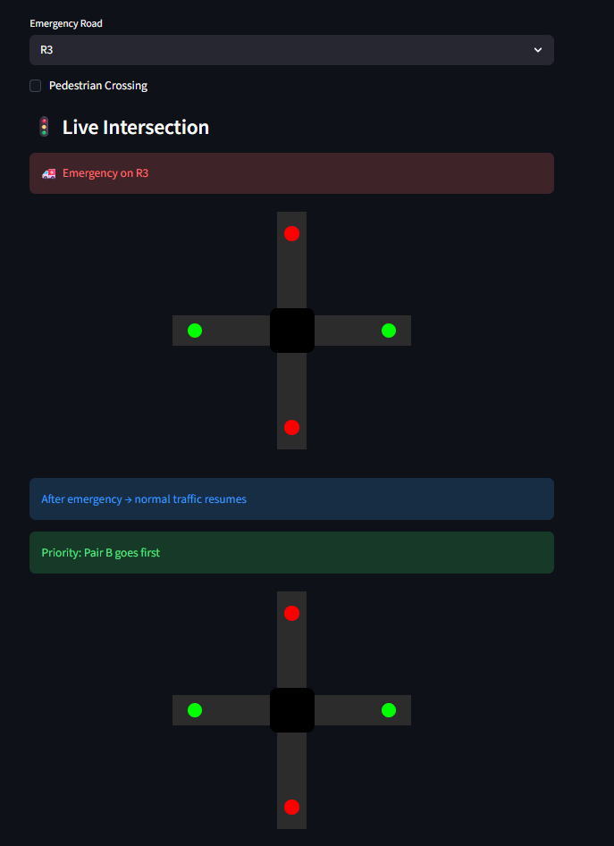
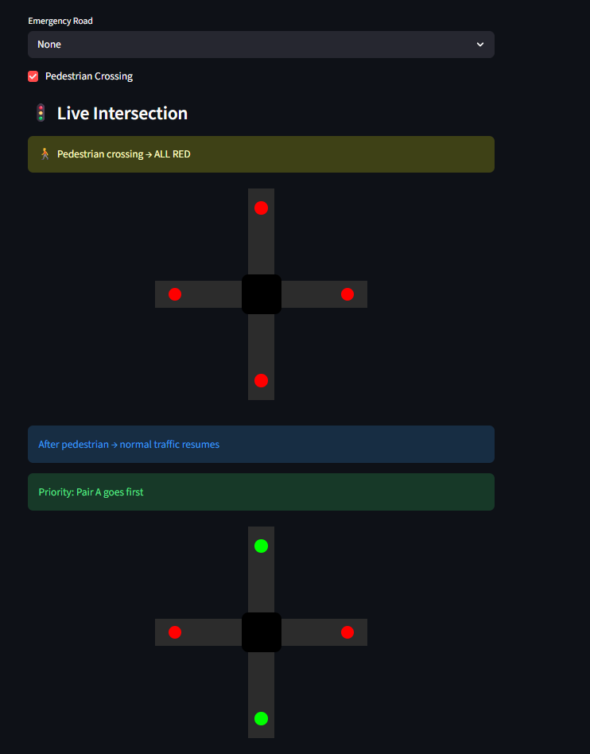
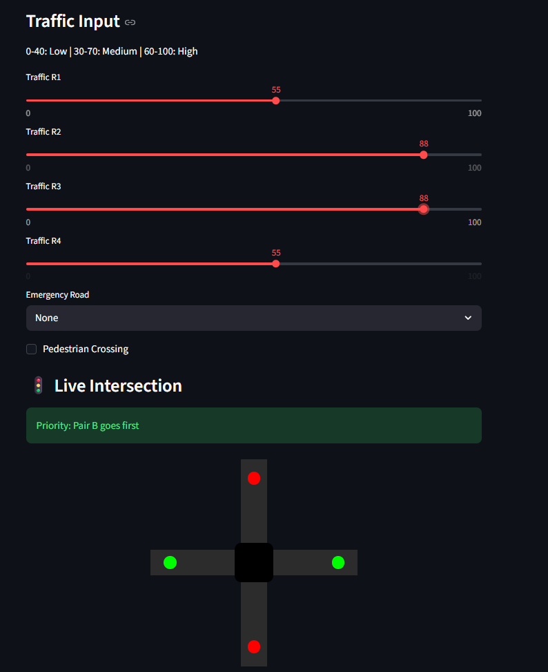

# 🚦 Smart Traffic Control using Fuzzy Logic

An intelligent traffic management system that uses **Fuzzy Logic** to dynamically control signal priorities at a 4-way intersection. The system adapts to real-time traffic density, supports emergency overrides, and provides an interactive **Streamlit-based visualization**.

---

## 📌 Overview

Traditional traffic lights operate on fixed timers, leading to inefficiencies. This project implements a **fuzzy inference system** to:

* Analyze traffic density
* Prioritize traffic flow dynamically
* Reduce congestion
* Handle real-world scenarios like emergencies and pedestrian crossings

---

## 🧠 Core Concepts Used

* Fuzzy Logic Control System
* Membership Functions (Low, Medium, High)
* Rule-Based Inference
* Defuzzification
* Real-time UI using Streamlit

---

## ⚙️ Features

### 🚗 Traffic-Based Decision Making

* Accepts input from 4 roads (R1, R2, R3, R4)
* Groups roads into:

  * **Pair A (Vertical)** → R1 + R4
  * **Pair B (Horizontal)** → R2 + R3

---

### 🧠 Fuzzy Logic System

* Inputs categorized into:

  * Low (0–40)
  * Medium (30–70)
  * High (60–100)
* Uses **9-rule fuzzy system** for decision making
* Produces smooth and realistic prioritization

---

### 🚑 Emergency Handling

* Immediate override for selected road
* Gives priority to corresponding direction

---

### 🚶 Pedestrian Crossing

* Stops all traffic temporarily
* Resumes normal flow afterward

---

### 🎨 Interactive Visualization

* Built using **Streamlit**
* Real-time intersection display
* Color-coded signals:

  * 🟢 Green → Active flow
  * 🔴 Red → Stopped

---

## 🗺️ Intersection Model

```
        R1
         |
R2 ----- + ----- R3
         |
        R4
```

* **Vertical Flow (A)** → R1 + R4
* **Horizontal Flow (B)** → R2 + R3

---

## 🧪 Fuzzy Rule Base

| Traffic A | Traffic B | Decision |
| --------- | --------- | -------- |
| Low       | Low       | A        |
| Low       | Medium    | B        |
| Low       | High      | B        |
| Medium    | Low       | A        |
| Medium    | Medium    | A        |
| Medium    | High      | B        |
| High      | Low       | A        |
| High      | Medium    | A        |
| High      | High      | A        |

---

## 🛠️ Tech Stack

* **Python**
* **scikit-fuzzy**
* **Streamlit**
* **NumPy**

---

## 🚀 Installation & Setup

### 1️⃣ Clone the Repository

```bash
git clone https://github.com/your-username/smart-traffic-fuzzy.git
cd smart-traffic-fuzzy
```

### 2️⃣ Create Virtual Environment

```bash
python -m venv venv
source venv/bin/activate   # Windows: venv\Scripts\activate
```

### 3️⃣ Install Dependencies

```bash
pip install -r requirements.txt
```

### 4️⃣ Run the Application

```bash
streamlit run app.py
```

---

## 🎯 How It Works

1. User inputs traffic density via sliders
2. System aggregates:

   ```python
   pairA = (R1 + R4) / 2
   pairB = (R2 + R3) / 2
   ```
3. Fuzzy rules evaluate traffic conditions
4. Output is defuzzified to decide priority
5. UI updates in real-time

---

## 🧠 Key Learnings

* Designing fuzzy membership functions
* Handling overlapping rules
* Importance of correct input aggregation
* Real-world mapping of traffic systems
* UI integration with ML logic

---

## ⚠️ Challenges Faced

* Incorrect road pairing logic initially
* Rule bias due to overlapping memberships
* Debugging fuzzy output inconsistencies
* Handling edge cases (all zero traffic)

---

## 🔮 Future Improvements

* ⏱ Dynamic signal timing based on traffic intensity
* 🚗 Vehicle movement animation
* 📊 Fuzzy rule visualization (graph)
* 🌐 Deployment on Streamlit Cloud
* 🤖 Integration with real traffic sensors

---

## 📸 Screenshots

<table>
  <tr>
    <td align="center"><br/>Intersection</td>
    <td align="center"><br/>Traffic Input</td>
  </tr>
  <tr>
    <td align="center"><br/>Emergency</td>
    <td align="center"><br/>Pedestrian</td>
  </tr>
  <tr>
    <td align="center"><br/>Rule Evaluation</td>
    <td></td>
  </tr>
</table>
